import CodeSandbox from "components/CodeSandbox";
import Repl from "components/Repl";

I see a lot of people, especially those new to React hooks, shy away from
[`useReducer`][usereducer] in favor of multiple `useState`s. I think some of it
is the simplicity of the `useState` API, and some of it is assumed complexity
via association with [Redux][]. In practice, `useReducer` has a lot more in
common with `useState` than Redux.

The `useState` API has two parts: the state and the state setter. When you want
to update the state, you replace it using the state setter.



The `useReducer` API has three parts: the state, an action dispatcher, and a
reducer to produce the new state.



When you want to update the state:

1. Dispatch an action.
1. The hook passes the current state and the action to the reducer function.
1. The reducer computes a new state.
1. The state is updated with the new state.

`useReducer` takes care of steps 2 and 4. You're responsible for steps 1 and 3.

## The Reducer Function

These are all valid signatures for reducer functions:

```js
(currentState, dispachedAction) => newState
(currentState) => newState
() => newState
```

As you can see, <mark>the primary job of a reducer is to produce a new
state</mark>, optionally taking into account the current state and the
dispatched action.

## Putting It All Together With useReducer

[The signature of `useReducer`][usereducer] is:

```js
const [state, dispatch] = useReducer(reducer, initialState);
```

You pass in a `reducer` function (and optionally an `initialState`) to
instantiate a `useReducer` hook. What you get back is a **read-only** `state`
and a `dispatch` function which you'll use to trigger the `reducer`.

This is one of the key differences when compared to `useState`—a `useReducer`
hook computes the next state internally using a `reducer` function, while a
`useState` hook relies entirely on external calculations for its next state.

For the rest of the article, we'll focus on different `reducer` (a.k.a. "new
state" calculator) implementation patterns.

## Reducer Without Any Params

`() => newState`

The primary job of a reducer is to return a new state. In its simplest form, a
reducer doesn't even need to accept any parameters.

```js{1,2,7,9}
const reducer = () => new Date();
const [date, update] = React.useReducer(reducer, new Date());

return (
  <main>
    <div>
      Now: {date.toLocaleDateString()} {date.toLocaleTimeString()}
    </div>
    <button onClick={() => update()}>Update</button>
  </main>
);
```

The names `state`, `dispatch`, and `reducer` are conceptual. In practice, you
can name them anything you like. In this example, they are `date` (state),
`update` (dispatch), and `reducer`.

Notice that we invoke `update()` _without_ passing in any parameters. The
dispatch function signals the hook to run the reducer function, it's up to you
whether you need to send an action with the signal or not. In this case, the
hook actually runs `reducer(currentState, undefined)`.

### 🤔 But Wait, the Reducer Doesn't Accept Any Params

That's right. In JavaScript, just because you pass parameters to a function,
doesn't mean it needs to accept them.

```js
const sayHi = () => "hi";
const result = sayHi(1, 2, 3);
// result === "hi"
```

<Repl
  repl="reducer-pattern-00"
  header=""
  title="function params"
  style={{ maxHeight: 300 }}
/>

<CodeSandbox
  as="h3"
  sandbox="reducer-pattern-00-zuet6"
  header="👩‍💻 Try the No-Params Reducer Example"
  title="no-params reducer"
  style={{ maxHeight: 375 }}
/>

## Reducer Using Current State

`(currentState) => newState`

This form of reducer is useful when you need the current state to calculate the
next state.

```js{1,2,6,7}
const reducer = (count) => count + 1;
const [count, addOne] = React.useReducer(reducer, 0);

return (
  <main>
    <div>{count}</div>
    <button onClick={() => addOne()}>Add 1</button>
  </main>
);
```

Once again, the dispatch function, `addOne()`, doesn't need to pass an action to
`reducer`—the `reducer` is capable of computing the next state entirely based on
the current state.

<CodeSandbox
  as="h3"
  sandbox="reducer-pattern-01-gmuic"
  title="current state reducer"
  style={{ maxHeight: 375 }}
/>

## Intermission

😅 Whew, let's take a break for now. Coming in part 2: we'll explore reducers
that use actions, as well as actions in combination with the current state.

[redux]: https://redux.js.org
[usereducer]: https://reactjs.org/docs/hooks-reference.html#usereducer
