import CodeSandbox from "components/CodeSandbox";

- [Part 1: Introduction to `useReducer` and basic reducer patterns][part-1]
- [Part 2: Reducers with actions][part-2]

So far in parts 1 and 2 of this series, we've learned that:

- the primary job of a reducer is to produce a new state
- dispatched actions can take any shape you want

In part 3, we'll be looking at the most common pattern of reducers and actions
that you'll come across in documentation and online examples, and model a state
chart using a reducer.

## Table of Contents

```toc

```

## Typical `useReducer` Pattern

Most `React.useReducer` examples you encounter dispatch actions that look
something like `{ type, paylod }`, with reducer functions that consists of a
switch statement that matches on `type` and uses the `payload` to calculate the
next state.

Remember the reducer signature is `(currentState, action) => nextState`. A
`switch` statement based reducer looks like:

```js
const reducer = (count, { type, payload }) => {
  switch (type) {
    case "add":
      return count + payload;
    case "reset":
      return initialValue;
    default:
      throw new Error();
  }
};
```

To trigger this reducer, there are two possible actions we can dispatch.

```js
dispatch({ type: "add", payload: 5 });
dispatch({ type: "reset" });
```

We can encapsulate these two possibilities with [bound action
creators][action creators]:

```js
const add = (payload) => dispatch({ type: "add", payload });
const reset = () => dispatch({ type: "reset" });
```

Action creators are optional—instead, you can just dispatch actions directly
where needed. They do offer a much nicer interface for the hook user by hiding
the reducer's implementation details.

The complete `useReducer` definition looks like:

```js
const initialValue = 0;
const reducer = (count, { type, payload }) => {
  switch (type) {
    case "add":
      return count + payload;
    case "reset":
      return initialValue;
    default:
      throw new Error();
  }
};

const [count, dispatch] = React.useReducer(reducer, initialValue);

const add = (payload) => dispatch({ type: "add", payload });
const reset = () => dispatch({ type: "reset" });
```

Our hook interface is now `count`, plus the `add()` and `reset()` functions.

<CodeSandbox
  as="h3"
  sandbox="reducer-pattern-04-k4vge"
  title="reducer with switch statement"
/>

## Tightly Coupled State Values

Great, so far we've explored quite a few reducer and action patterns, but we
haven't talked about _why_ we use `useReducer`. In fact, you can express the
previous example more clearly as a `useState` hook:

```js
const initialValue = 0;
const [count, setCount] = React.useState(initialValue);
const add = (value) => setCount(count + value);
const reset = () => setCount(initialValue);
```

<CodeSandbox
  as="h3"
  sandbox="reducer-pattern-041-1uptn"
  title="useReducer simplified with useState"
/>

The reason is because `useState` optimizes the use case of managing a single
state value. This implies that `useReducer`'s sweet spot is when we have more
than a single state value that we need to keep track of.

What if we want to add an undo function, so we can get back the previous counts?
One way is to keep track of the count history. Instead of just keeping track of
the latest count, our state now looks like:

```js
const initialState = { count: 0, history: [] };
```

We update the reducer with the following changes:

- Return the current state as-is if we add zero, since this action doesn't
  change the state.
- If we're adding any other value, also add the current count to the history
  stack.
- Add a new case to handle the `undo` action.

```js{5-6,9-12}
const reducer = (state, { type, payload }) => {
  const { count, history } = state;
  switch (type) {
    case "add":
      if (payload === 0) return state;
      return { count: count + payload, history: [...history, count] };
    case "reset":
      return initialState;
    case "undo":
      if (history.length === 0) return state;
      const lastCount = [...history].pop();
      return { count: lastCount, history: history.slice(0, -1) };
    default:
      throw new Error();
  }
};
```

Lastly we add another bounded action creator to handle `undo()`:

```js
const undo = () => dispatch({ type: "undo" });
```

Putting it all together:

```js
const initialState = { count: 0, history: [] };

const reducer = (state, { type, payload }) => {
  const { count, history } = state;
  switch (type) {
    case "add":
      if (payload === 0) return state;
      return { count: count + payload, history: [...history, count] };
    case "reset":
      return initialState;
    case "undo":
      if (history.length === 0) return state;
      const lastCount = [...history].pop();
      return { count: lastCount, history: history.slice(0, -1) };
    default:
      throw new Error();
  }
};

const [{ count, history }, dispatch] = React.useReducer(reducer, initialState);

const add = (payload) => dispatch({ type: "add", payload });
const reset = () => dispatch({ type: "reset" });
const undo = () => dispatch({ type: "undo" });
```

We see that `count` and `history` are tightly coupled. When we add a value, we
update `count` and add the previous count to the `history` stack. When we undo,
we replace `count` by popping the last item from the `history` stack.

<CodeSandbox
  as="h3"
  sandbox="reducer-pattern-05-wtl5n"
  title="tightly coupled state values"
/>

## Nested Switch Statements

Did you know you can nest a `switch` statement inside the `case` clause of
another switch statement? Using this technique, you can perform very
sophisticated actions with the `useReducer` hook, especially when coupled with
`useEffect`.

Let's make a seemingly simple form with a single input and couple buttons:

- The input will only accept `[A-Za-z]` characters
- Submit button to POST the input value to an API
- Reset button to reset the input value to the last successful submission

Easy peasy, right? That's how forms always start out, except when you start
considering:

- If input is invalid, display error message and don't allow submission.
- Don't allow submission if input value hasn't changed from the previous
  submission.
- During submission, disable all inputs.
- Display submission status.
- When submission error occurs, the submit button remains active to allow for
  retry.

How would you satisfy all these requirements? Try to capture all the logic
imperatively? Use one of the many React form libraries? I happen to think [state
charts][] are a great way to declaratively satisfy all the requirements.



Our state chart has four states—editing, submitting, resolved, rejected—with
clear transitions defined among the states, e.g. we transition from `editing` to
`submitting` state by performing the `submit` action.

### Initial Hook State

First let's establish what our `useReducer` hook state looks like. Note that the
hook state is different than the state of a state chart. Our hook state looks
like:

```js
const initialState = {
  value: "editing",

  context: {
    previousValue: "",
    value: "",
    isValid: true,
    submitAllowed: false,
    isSuccessful: undefined,
  },
};
```

The `value` entry holds our state chart state. We also have a separate `context`
entry that keeps track of the [extended state][].

### Translate a State Chart to a Reducer Function

```js{3-5,25-27}
const reducer = (state, { type, payload } = {}) => {
  const { value, context } = state;
  switch (value) {
    case "editing":
      switch (type) {
        case "change":
          const isValid = /^[A-Za-z]*$/.test(payload);
          const submitAllowed = isValid && context.previousValue !== payload;
          return {
            value,
            context: { ...context, value: payload, isValid, submitAllowed },
          };

        case "reset":
          return {
            value,
            context: {
              ...context,
              value: context.previousValue,
              isValid: true,
              submitAllowed: false,
            },
          };

        case "submit":
          if (context.submitAllowed) return { value: "submitting", context };
          return state;

        default:
          return state;
      }

    case "submitting":
      switch (type) {
        case "resolve":
          return { value: "resolved", context };
        case "reject":
          return { value: "rejected", context };
        default:
          return state;
      }

    case "resolved":
      return {
        value: "editing",
        context: {
          ...context,
          previousValue: context.value,
          isSuccessful: true,
          submitAllowed: false,
        },
      };

    case "rejected":
      return {
        value: "editing",
        context: {
          ...context,
          isSuccessful: false,
        },
      };

    default:
      return state;
  }
};
```

Notice the top level `switch` is based on the `state.value` (state chart state)
expression. For `editing` and `submitting` states, we further switch on
`action.type` (state chart transition). Why do we do this? This guarantees that,
for example, the `submit` transition is only valid if our state chart is in the
`editing` state. Practically, this means that if the form is in the `submitting`
state, it can't be submitted again no matter how hard we try (we've just solved
the multiple button click issue, even if we forget to disable the submit
button).

If you compare the code to the diagram, you'll see that each `case` clause
corresponds to a transition—seven transitions, seven `case` clauses that return
the next state.

Notice the `default` clauses always return the original state as-is. This is
generally how state machines work—if you try to specify an illegal transition,
the state remains as-is.

Looking at each `case` clause, you'll notice that we're performing couple tasks:

1. Specify the next state by changing `state.value`.
1. Changing `state.context` as appropriate for a given transition.

### Putting It All Together

```js
const [state, dispatch] = React.useReducer(reducer, initialState);
const transitions = {
  change: (payload) => dispatch({ type: "change", payload }),
  reset: () => dispatch({ type: "reset" }),
  submit: () => dispatch({ type: "submit" }),
};
```

To start transitions, we use the `dispatch()` function from the `useReducer`
hook. Transitions can be manually triggered (user clicking a button) via event
handlers, or automatically triggered (when state changes) via `useEffect`.

Complex state charts topics are beyond the scope of this article. What we're
demonstrating here is that you can in fact model fairly complex systems (if
somewhat awkwardly) using reducers.

<CodeSandbox
  as="h3"
  sandbox="reducer-pattern-06-vsdno"
  title="state chart using useReducer and useEffect"
/>

If you're curious about state charts, I highly recommend checking out
[XState][].

## Takeaways

- Use `React.useReducer` when you need to keep track of multiple tightly-coupled
  state values.
- Reducers are capable of modeling complex systems.
- Consider making your `useReducer` hook more user friendly with action
  creators.

As we've seen in this series of articles, `useReducer` is a hook pattern capable
of solving a wide variety of simple to moderately complicated problems. Now that
the scariest part of the pattern—reducers—is less scary, I hope you'll reach for
it more frequently, with creativity.

- [Part 1: Introduction to `useReducer` and basic reducer patterns][part-1]
- [Part 2: Reducers with actions][part-2]

[action creators]: https://redux.js.org/basics/actions#action-creators
[extended state]:
  https://en.wikipedia.org/wiki/UML_state_machine#Extended_states
[part-1]: /articles/reducer-patterns/part-1/
[part-2]: /articles/reducer-patterns/part-2/
[state charts]: https://statecharts.github.io
[xstate]: https://xstate.js.org/docs/
