import CodeSandbox from "components/CodeSandbox";
import Repl from "components/Repl";

I see a lot of people, epsecially those new to React hooks, shy away from
[`useReducer`][usereducer] in favor of multiple `useState`s. I think some of it
is the simplicity of the `useState` API, and some of it is assumed complexity
via association with [Redux][]. In practice, `useReducer` has a lot more in
common with `useState` than Redux.

The `useState` API has two parts: the state and the state setter. When you want
to update the state, you replace it using the state setter.

The `useReducer` API has three parts: the state, an action dispatcher, and a
reducer to produce the new state.



When you want to update the state:

1. Dispatch an action
1. The current state and the action are passed to the reducer function
1. The reducer computes a new state
1. The state is updated with the new state

`useReducer` takes care of steps 2 and 4, so you're responsible for steps 1
and 3.

## Reducer Function

These are all valid signatures for reducer functions:

```js
(currentState, dispachedAction) => newState
(currentState) => newState
() => newState
```

As you can see, the primary job of a reducer is to produce a new state,
optionally taking into account the current state and the dispatched action.

## Putting It All Together With useReducer

[The signature of `useReducer`][usereducer] is:

```js
const [state, dispatch] = useReducer(reducer, initialState);
```

Your interactions with the hook are to read the `state`, and `dispatch` actions
to update the state. Let's focus on different `reducer` (a.k.a. "new state"
calculator) implementation patterns.

## Reducer Without Any Params

The primary job of a reducer is to return a new state. In its simplest form, a
reducer doesn't even need to accept any parameters.

```js{1-2,9}
const reducer = () => new Date();
const [date, update] = React.useReducer(reducer, new Date());

return (
  <main>
    <div>
      Now: {date.toLocaleDateString()} {date.toLocaleTimeString()}
    </div>
    <button onClick={() => update()}>Update</button>
  </main>
);
```

As you can see, the names `state`, `dispatch`, and `reducer` are all conceptual.
In practice, you can name them anything you like. In this example, they are
`date` (state), `update` (dispatch), and `reducer`.

Also notice that when we invoke `update()`, we're doing it _without_ passing in
any parameters. `dispatch` signals the hook to activate the reducer to compute
the new state, it's up to you whether you need to send an action with the signal
or not. In this case, the hook is actually invoking the reducer with
`(currentState, undefined)`.

### 🤔 Wait, but the Reducer Doesn't Accept Any Params

That's right. In JavaScript, just because you pass parameters to a function,
doesn't mean it needs to accept them.

```js
const sayHi = () => "hi";
const result = sayHi(1, 2, 3);
// result === "hi"
```

<Repl
  repl="FunctionalScientificDeletion"
  title="function params"
  style={{ maxHeight: 300 }}
/>

<CodeSandbox
  as="h3"
  sandbox="reducer-pattern-00-zuet6"
  header="👩‍💻 Try the No-Params Reducer Example"
  title="no-params reducer"
  style={{ maxHeight: 375 }}
/>

## Reducer Using Current State

```js{1-2,7}
const reducer = (count) => count + 1;
const [count, addOne] = React.useReducer(reducer, 0);

return (
  <main>
    <div>{count}</div>
    <button onClick={() => addOne()}>Add 1</button>
  </main>
);
```

<CodeSandbox
  as="h3"
  sandbox="reducer-pattern-01-gmuic"
  title="simple reducer"
  style={{ maxHeight: 375 }}
/>

## Accepts a Param

```js{1-2,10}
const reducer = (count, newCount) => newCount;
const [count, setCount] = React.useReducer(reducer, 0);

return (
  <main>
    <div>Count: {count}</div>
    <form
      onSubmit={(e) => {
        e.preventDefault();
        setCount(count + Number(e.currentTarget.numberToAdd.value));
      }}
    >
      <label>
        Add to count:{" "}
        <input
          name="numberToAdd"
          type="number"
          defaultValue={1}
          style={{ width: "4em" }}
        />
      </label>
      <button>Add</button>
    </form>
  </main>
);
```

Wait a minute, that looks a lot like `React.useState`.

<CodeSandbox
  as="h3"
  sandbox="reducer-pattern-02-ohxdv"
  title="reducer accepts a
param"
/>

## Simple React.useState

Replace

```js
const reducer = (count, newCount) => newCount;
const [count, setCount] = React.useReducer(reducer, 0);
```

with

```js
const reducer = (prevState, newState) => newState;
const useState = (initialState) => React.useReducer(reducer, initialState);
const [count, setCount] = useState(0);
```

We have ourselves a simple `useState` and see that `React.useState` is syntactic
sugar for `React.useReducer`, accommodating the most common use case of updating
a single state value. A complete re-implementation of the `useState` is a few
more lines of code. [See Kent C. Dodd's "How to implement useState with
useReducer"][implement-usestate] if you're interested in an in-depth
explanation.

<CodeSandbox
  as="h3"
  sandbox="reducer-pattern-03-1keqr"
  title="useState implemented using useReducer"
/>

## Common Case

### Reducer

Most reducers you see take the form of a `switch` statement.

```js
const reducer = (count, { type, payload }) => {
  switch (type) {
    case "add":
      return count + payload;
    case "reset":
      return initialValue;
    default:
      throw new Error();
  }
};
```

### Initialize the Hook and Create Convenience Functions

```js
const [count, dispatch] = React.useReducer(reducer, initialValue);
const add = (payload) => dispatch({ type: "add", payload });
const reset = () => dispatch({ type: "reset" });
```

Rest is wiring up `add()` and `reset()` functions to user actions.

<CodeSandbox
  as="h3"
  sandbox="reducer-pattern-04-k4vge"
  title="reducer with switch statement"
/>

## Tightly Coupled State Values

```js
const initialState = { count: 0, history: [] };
const reducer = (state, { type, payload }) => {
  const { count, history } = state;
  switch (type) {
    case "add":
      return { count: count + payload, history: [...history, count] };
    case "reset":
      return { ...initialState };
    case "undo":
      if (history.length === 0) return state;
      const lastCount = [...history].pop();
      return { count: lastCount, history: history.slice(0, -1) };
    default:
      throw new Error();
  }
};
```

```js
const [{ count, history }, dispatch] = React.useReducer(reducer, initialState);
const add = (payload) => dispatch({ type: "add", payload });
const reset = () => dispatch({ type: "reset" });
const undo = () => dispatch({ type: "undo" });
```

<CodeSandbox
  as="h3"
  sandbox="reducer-pattern-05-wtl5n"
  title="tightly coupled state values"
/>

[implement-usestate]:
  https://kentcdodds.com/blog/how-to-implement-usestate-with-usereducer
[redux]: https://redux.js.org
[usereducer]: https://reactjs.org/docs/hooks-reference.html#usereducer
